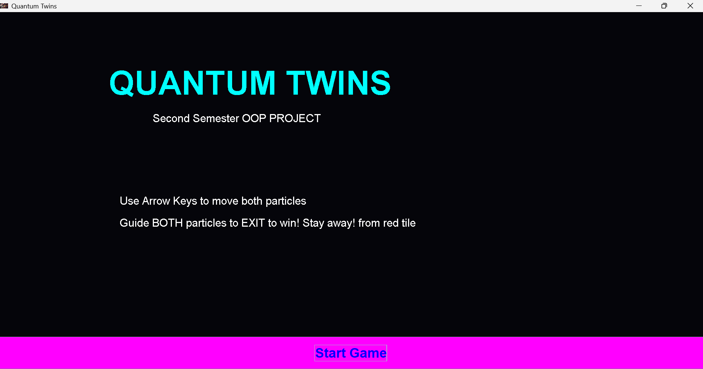
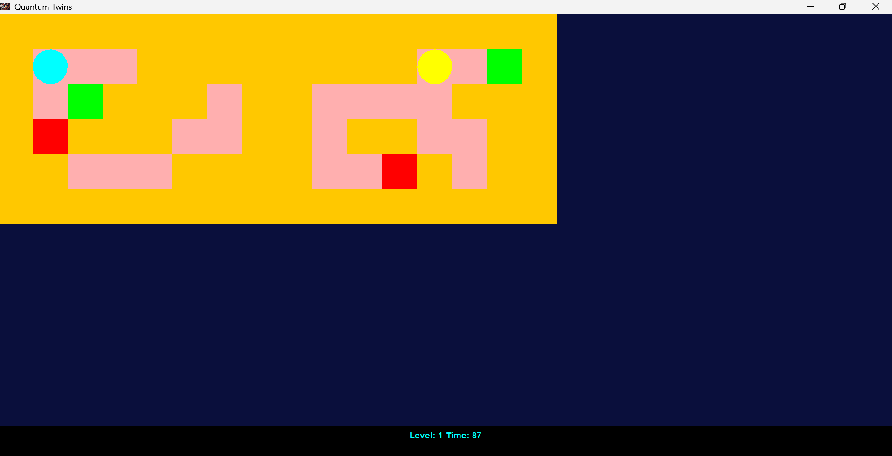
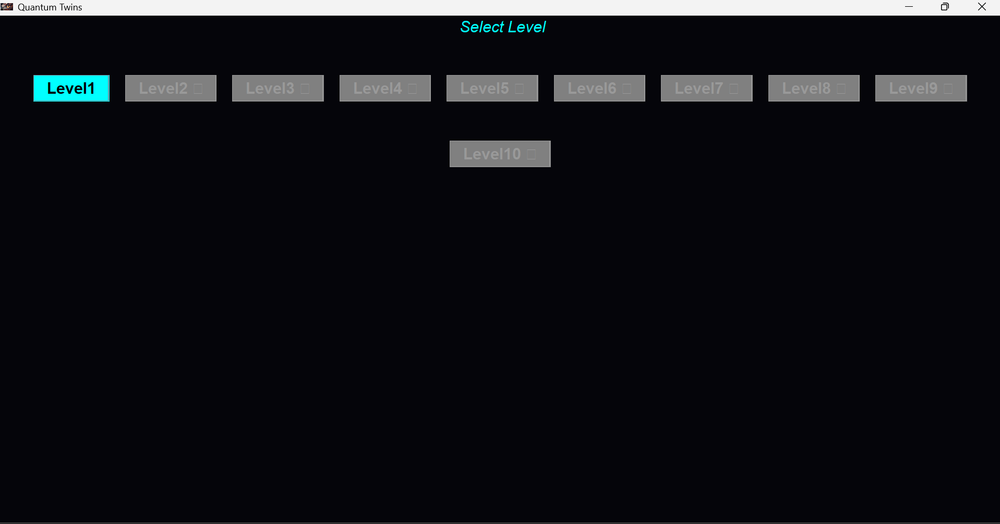
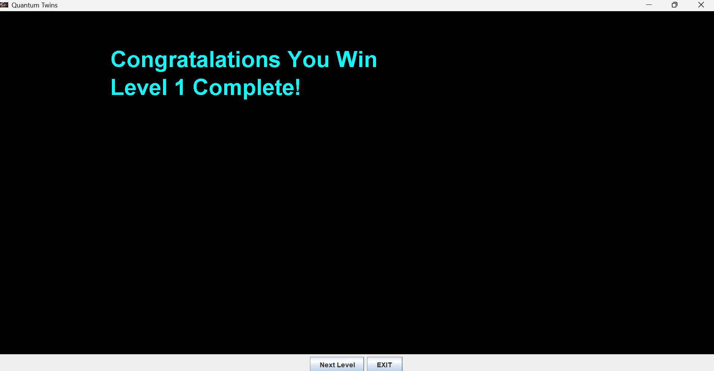
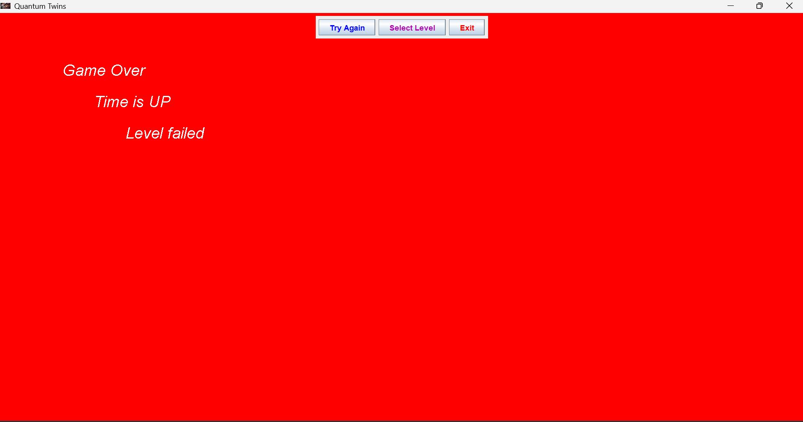

# Quantum Twins

Quantum Twins is a Java Swing puzzle game inspired by quantum entanglement. Control two particles navigating parallel mazes with synchronized movement, overcome obstacles, and use quantum reversal mechanics to guide both particles to their exits.

## Features

- Two parallel mazes
- Synchronized particle movement
- Quantum reversal zones
- Exit-based puzzle gameplay
- Built with Java Swing

## Controls

- ↑ Move Up
- ↓ Move Down
- ← Move Left
- → Move Right

## Technologies Used

- Java
- Java Swing
- Object-Oriented Programming (OOP)

## Note

This project was developed as a personal learning project. The code may contain bugs or areas for improvement. Feedback, suggestions, and pull requests are always welcome.  

## License
This project is licensed under the MIT License.

## Screenshots
### Welcome Screen

### Main Level

### Level Selection

### Level Complete

### Level Failed

